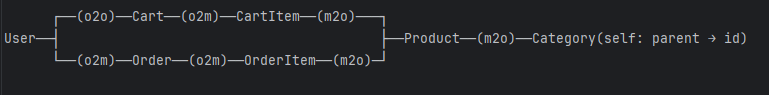
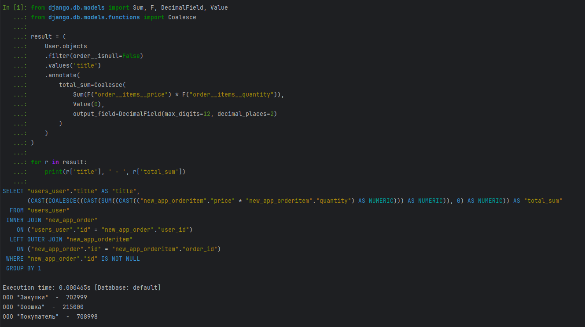
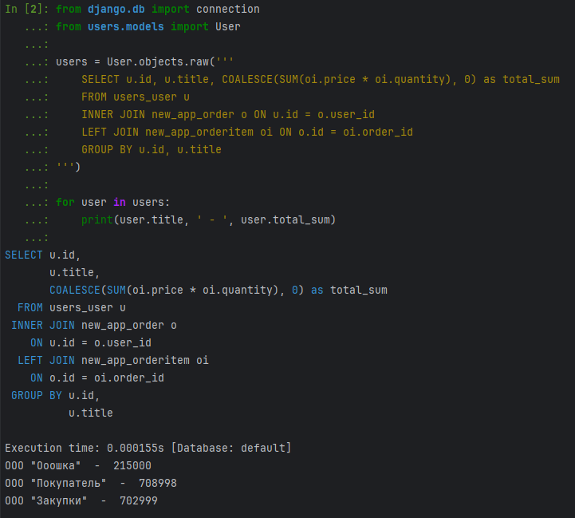
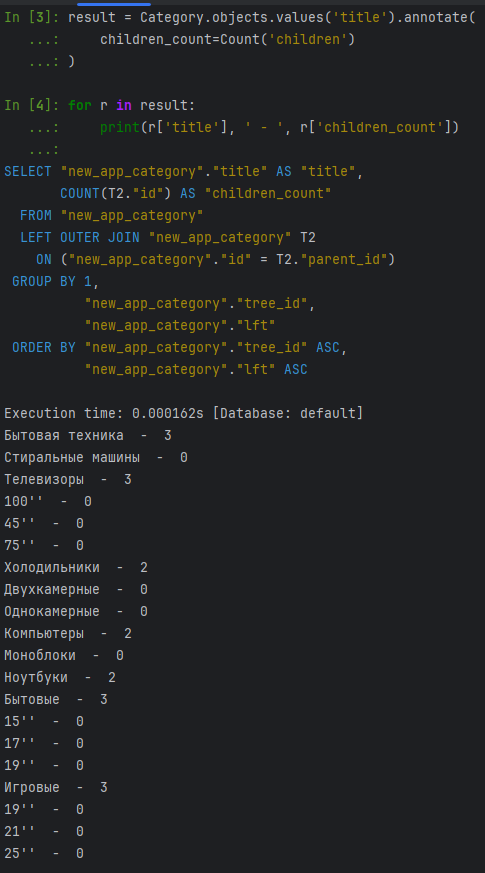
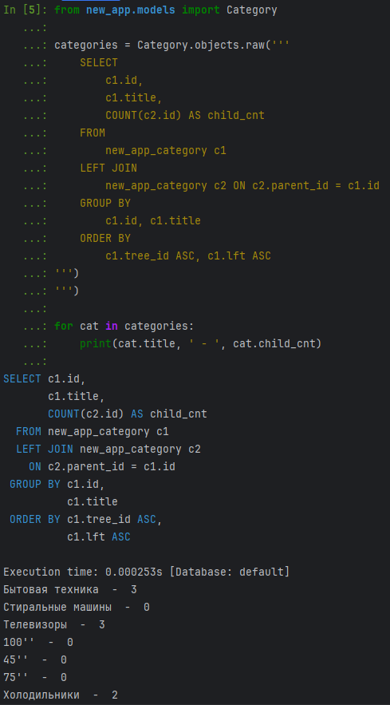
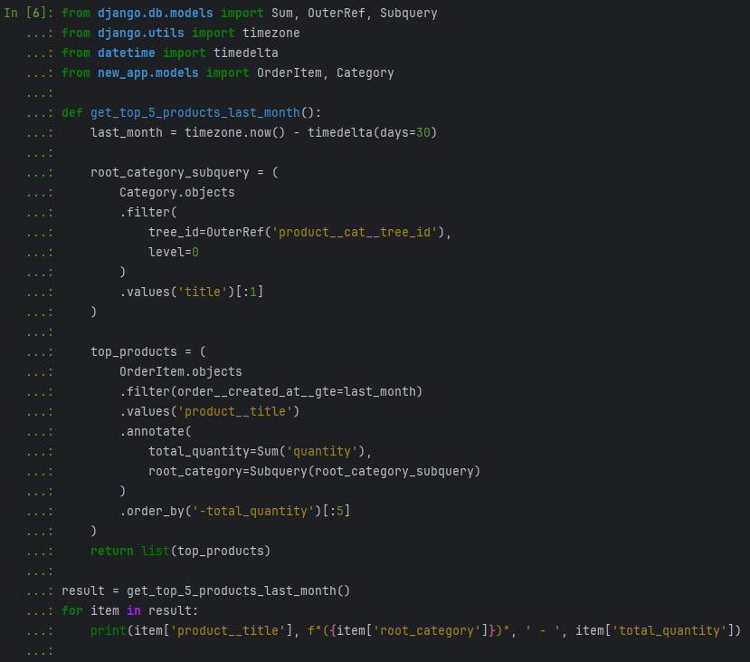
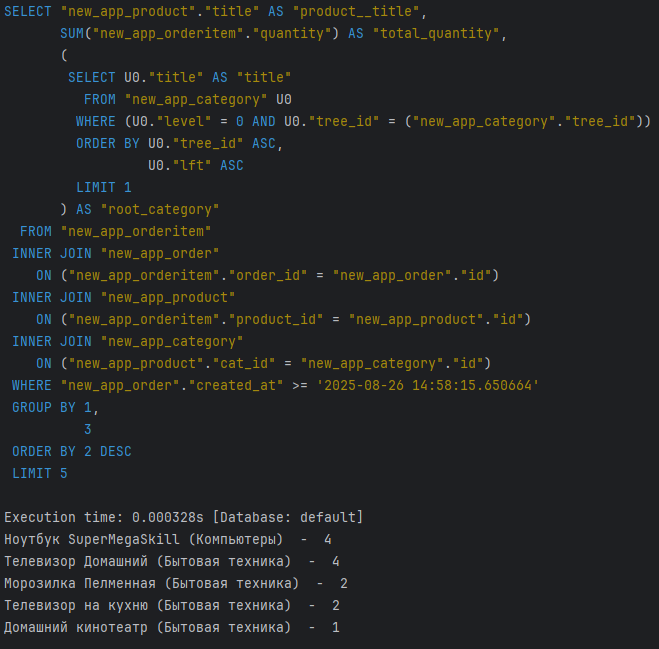
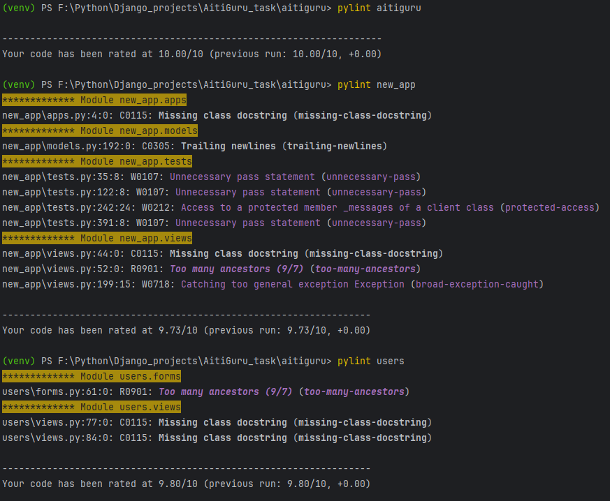
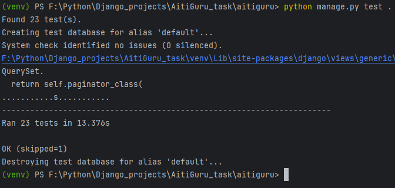

#  Тестовое задание для AitiGuru (Текст задания в ТЗ.txt)

## 1) Схема БД
### 1. User (Покупатель)
* id — PK
* username — str (unic)
* email — email
* title — str (unic, not null)
* address — str (not null)

### 2. Category (Категория)
* id — PK
* title — str (blank, not unic)
* parent_id — TFK → Category.id (m2o ,blank)

### 3. Product (Товар)
* id — PK
* title — str (unic, not null)
* cat_id — FK → Category.id (m2o, not null)
* count — int
* price — float (Decimal)

### 4. Cart (Корзина)
* id — PK
* user_id — FK → User.id (o2o, not null)
* created_at — datetime

### 5. CartItem (Элемент корзины)
* id — PK
* cart_id — FK → Cart.id (m2o, not null)
* product_id — FK → Product.id (m2o, not null)
* quantity — int

### 6. Order (Заказ)
* id — PK
* order_number — str (unic)
* user_id — FK → User.id (o2m, not null)
* created_at — datetime

### 7. OrderItem (Элемент заказа)
* id — PK
* order_id — FK → Order.id (m2o, not null)
* product_id — FK → Product.id (m2o, not null)
* quantity — int
* price — float (Decimal)

### Схема связей

## 2) SQL запросы
#### 2.1 ORM запрос

#### 2.1 SQL запрос

#### 2.2 ORM запрос

#### 2.2 SQL запрос

#### 2.3.1 Запрос

#### 2.3.1 Ответ

### Варианты оптимизации на основании отчета 2.3.1
* Масштабирование может привести к n+1 проблеме, может понадобиться написание индекса
* Запрос корневой категории работает через Subquery, это не эффективно. Стоит хранить родителя 1-го уровня для каждой категории в БД (лучше в Product)
* Для сбора статистики по данному отчету можно создать отдельную таблицу Товаров с посуточными продажами. Можно автоматизировать через Celery
* Так же, в качестве доп оптимизации, можно кэшировать данные главной страницы и отчет по продажам (если к нему обращаются часто, а не раз в день)

## 3) Сервис в репозитории

### В сервисе реализовано (на уровне backend, front примитивный):
 * Главная страница со всеми товарами и списком категорий для фильтрации (sidebar)
 * Просмотр индивидуальной карточки товара
 * Добавление в корзину выбранного количества товаров (не более чем в запасах), как из главной страницы, так и из карточки
 * Оформление заказа (очистка корзины и перевод товаров внутри БД согласно ACID)
 * Регистрация, авторизация, профиль пользователя, смена пароля и данных пользователя (без подтверждения почты или авторизации через соц. сервисы)
 * Присутствуют документация, линтер и unittest (приложения new_app и users)
 * Написан простой(достаточный) dockerfile

#### Проверка чистоты кода через pylint

#### Результат тестов

